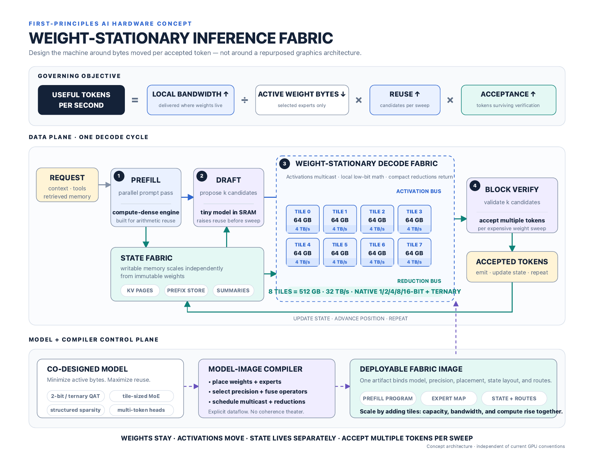
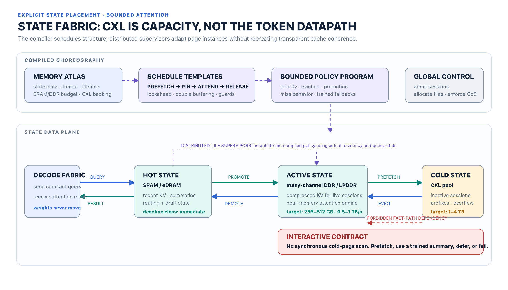
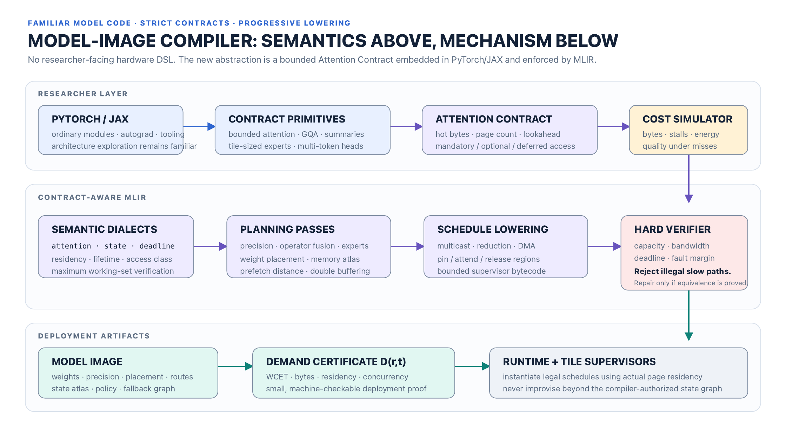
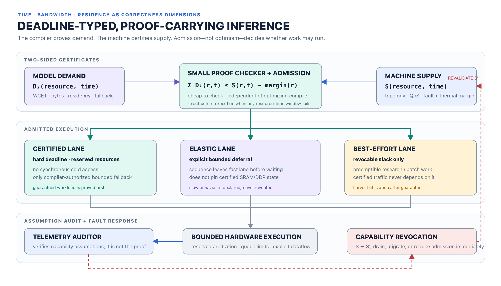

# Executive summary

<div class="status-line">STATUS: CONCEPT ARCHITECTURE — a falsifiable systems proposal, not a measured silicon result or production guarantee.</div>

Large-model serving is normally treated as a throughput-optimization problem with latency measured after deployment. Schedulers fill accelerators, memory systems behave statistically, and operators discover the real service envelope through p95 and p99 telemetry. That approach can be efficient, but it cannot make a hard statement that a particular token step will complete within a declared deadline under an admitted workload. A synchronous cold-memory miss, an unlucky mixture-of-experts route, or a competing tenant can turn a nominally fast system into an uncontrolled tail-latency event.

This proposal defines a different category of machine: a **certifying real-time dataflow computer** for neural inference. Its central rule is simple:

> Time, bandwidth, and residency are correctness dimensions, not performance hints.

The model author declares an **Attention Contract**: a bounded description of the information each layer may consume, how much state may be live, when that state must be ready, and what semantically valid behavior is permitted when optional state is unavailable. A contract-aware compiler lowers the model through custom MLIR dialects, chooses placement and prefetch schedules, computes worst-case resource demand, and emits a model image with a machine-checkable **demand certificate**. The hardware publishes a **capability certificate** describing bounded compute, memory, interconnect, power, and fault-containment service. A small independent checker admits work only when the aggregate demand can be proven to fit the available supply in every relevant resource-time window.

The architecture combines four mutually dependent ideas:

1. **Weight-stationary dataflow.** Model weights remain assigned to compute or expert tiles. Activations and compact queries move through the fabric; the appliance does not repeatedly ship the full active weight set across a shared external memory path for each token.
2. **Explicit state choreography.** KV cache, recurrent summaries, routing state, and prefixes occupy a compiler-managed hierarchy: immediate state in SRAM/eDRAM, active-session state in high-bandwidth DDR/LPDDR near state-processing engines, and cold capacity in a CXL pool. CXL is capacity and migration backing, never an implicit interactive token datapath.
3. **Deadline-typed compilation.** Tensor values carry placement, lifetime, maximum byte count, and readiness obligations in addition to shape and dtype. Illegal synchronous cold accesses fail compilation. Automatic repair is allowed only when semantic equivalence and all budgets can be re-proved.
4. **Proof-carrying admission.** The optimizing compiler is not trusted at deployment. Its output carries a certificate checked by a deliberately small verifier. Certified work receives reserved resources; elastic work may defer through declared state transitions; best-effort work may consume only revocable slack.

This is not a claim that hard real-time inference can be obtained by attaching a certificate to a conventional GPU server. The proof is meaningful only if the machine exposes bounded service: reserved bandwidth, bounded queues, predictable arbitration, admission control, explicit refresh/ECC/retry allowances, thermal headroom, and fail-fast capability revocation. Where the physical system cannot produce a finite upper bound, the compiler cannot certify an interactive image.

The proposal is novel primarily in its composition and proof boundary, not because every component is unprecedented. It draws from dataflow accelerators, I/O-aware attention, sparse and paged KV management, CXL memory pooling, worst-case execution-time analysis, deterministic network calculus, slack stealing, proof-carrying code, and MLIR's extensible intermediate representation. Existing work demonstrates that each ingredient is technically serious. What it does not yet provide is a model-to-machine contract that makes bounded neural data movement a deploy-time correctness property.

The recommended next step is not custom silicon. It is a software reference system that can falsify the thesis cheaply: a contract API in PyTorch/JAX, custom MLIR dialect prototypes, a state-fabric simulator, a resource-curve certificate format, and an independent checker. The first go/no-go question is whether useful models can retain acceptable quality under bounded information flow while the compiled schedules remain tight enough to outperform conservative overprovisioning.

<div class="metric-grid">
  <div class="metric-card"><div class="kicker">Correctness unit</div><div class="value">Value ready at location by deadline</div></div>
  <div class="metric-card"><div class="kicker">Deployment unit</div><div class="value">Model image + demand certificate</div></div>
  <div class="metric-card"><div class="kicker">Scheduler authority</div><div class="value">Schedulability proof, not p99</div></div>
  <div class="metric-card"><div class="kicker">Cold-memory rule</div><div class="value">Prefetch, fallback, defer, or fail</div></div>
</div>

## Decision requested

Approve a staged architecture-validation program with explicit kill criteria. Do **not** begin a silicon program until the software prototype demonstrates all of the following:

- bounded-state models can reach an agreed quality threshold on representative long-context tasks;
- resource certificates remain compositional under multi-model admission;
- the checker can validate certificates cheaply enough to sit on the deployment path;
- a hardware emulator can maintain bounded service under interference, refresh, correctable errors, and controlled link degradation;
- the certified lane provides a material latency or capacity advantage over a conservatively provisioned conventional serving baseline.

# Problem definition

## The serving stack optimizes an observation, not a promise

Modern inference systems have made major advances in continuous batching, paged KV allocation, kernel fusion, quantization, offloading, and speculative generation. Those systems usually optimize throughput subject to empirical latency targets. Admission reacts to queue length, observed utilization, or recent latency. Resource contention is tolerated until a measured service-level objective approaches its limit.

That is an appropriate design for best-effort cloud workloads. It is structurally different from a system that must know *before launch* whether a request can finish each decode step on cadence. A measured percentile is a description of prior samples. It is not a proof that a future combination of sequence lengths, attention pages, expert routes, refresh events, link retries, and co-tenant bursts will remain inside the same envelope.

The practical failure mode is a hidden slow path. A compiler or runtime encounters a missing page, transparently fetches it from a colder tier, and lets the shared batch wait. The average may remain excellent while a small number of requests inherit unbounded or poorly bounded delay. If the deployed artifact claims a 20 ms token deadline, such a fetch is not merely a performance regression. It violates the artifact's declared type.

## Decode is a data-movement problem

Autoregressive decode performs relatively little useful work per parameter byte compared with prefill. At batch sizes constrained by latency, the same active weights are repeatedly consumed for one or a few newly generated tokens. The Roofline model formalized the general relationship between operational intensity, bandwidth, and attainable performance [1]. FlashAttention later showed how strongly attention performance depends on explicitly accounting for movement between memory levels [4]. This proposal applies the same physical discipline at appliance scale.

For a model step, a useful lower-bound abstraction is:

<div class="equation">T<sub>step</sub> ≥ max(T<sub>compute</sub>, B<sub>weight</sub>/BW<sub>weight</sub>, B<sub>state</sub>/BW<sub>state</sub>, B<sub>network</sub>/BW<sub>network</sub>) + T<sub>control</sub></div>

Conventional stacks reduce the observed terms through batching and caching. The proposed machine instead makes the relevant byte counts, service rates, and interference allowances explicit enough to bound each term. It also attacks `B_weight` per accepted token by keeping weights stationary within assigned domains and by verifying multiple candidate tokens per weight sweep when the model supports it.

## State grows differently from weights

Weights are mostly immutable and shared. Inference state is session-specific, grows with context, and changes every token. Treating both as generic accelerator memory produces avoidable contention:

- weight traffic is predictable but enormous;
- KV traffic is smaller per access but variable across sequence length and attention policy;
- routing and retrieval introduce conditional references;
- paused sessions need cheap capacity but not interactive bandwidth;
- prefixes may be shareable across sessions, while private state requires isolation;
- a transparent cache obscures which miss will land on the critical path.

The platform therefore separates the **weight fabric** from the **state fabric** and makes transfers between state tiers compiler-visible. Coherence may still exist for control-plane convenience, but it is not the execution model of the certified token path.

## Long context makes optimistic memory semantics untenable

PagedAttention demonstrates that fixed-size blocks and virtualized KV management can dramatically reduce fragmentation and enable sharing [5]. FlexGen demonstrates that coordinated placement and offloading can make otherwise infeasible models run on limited memory, explicitly targeting throughput-oriented, latency-insensitive workloads [7]. H2O and StreamingLLM show that not every historical KV entry contributes equally and that bounded retained state can preserve useful behavior in important settings [10, 11].

These results support three premises:

1. state placement is a first-order architectural concern;
2. model semantics can often tolerate structured bounds or learned summaries;
3. the correct policy depends on service class.

They do not establish that arbitrary remote state can be fetched synchronously while preserving an interactive deadline. The proposed Attention Contract makes that distinction mandatory.

## Requirements

The target system shall:

- provide a finite, inspectable upper bound for every resource used by certified execution;
- reject a workload before execution if its declared deadline cannot be proven;
- keep interactive execution independent of synchronous cold-memory service;
- support multiple models and tenants through compositional resource certificates;
- preserve useful utilization through bounded elastic work and revocable slack;
- allow model research in familiar frameworks rather than requiring a hardware programming language;
- isolate the deployment trust boundary from the complexity of the optimizing compiler;
- surface contract violations with actionable, quantitative diagnostics;
- degrade only through model-declared, trained, and compiler-certified behavior;
- revalidate admission when physical capability changes.

## Non-goals

This design does not attempt to:

- prove factual correctness, safety, alignment, or semantic quality of model outputs;
- guarantee service through unmodeled catastrophic hardware failure;
- make every existing Transformer checkpoint deployable without adaptation;
- eliminate dynamic scheduling or runtime observation;
- maximize average utilization at the expense of certified isolation;
- replace PyTorch, JAX, or the broader ML compiler ecosystem;
- claim that CXL, near-memory compute, or custom silicon already delivers the bounds assumed here.

# Architectural thesis

## Deadline-typed inference

A conventional tensor type describes mathematical compatibility:

```text
Tensor<shape, dtype>
```

A deadline-typed value carries a spatiotemporal contract:

```text
Tensor<
  shape,
  dtype,
  residency_set,
  max_bytes,
  ready_by,
  lifetime,
  access_class,
  service_class
>
```

The exact syntax is illustrative. The semantic rule is not: a consumer may execute only if the compiler can show that its input will exist at an allowed location before its deadline, within capacity and reserved bandwidth. Shape correctness proves the math is well formed. Spatiotemporal correctness proves the scheduled machine can perform the math on cadence under the certified assumptions.

Deadline types may be static or parametric. A model image can be certified for ranges such as sequence length `≤ L`, active sessions `≤ N`, batch width within `[b_min, b_max]`, retrieval pages `≤ k`, and a named hardware capability class. Parameters outside the certified range require a different artifact or explicit rejection.

## The Attention Contract

The Attention Contract is the researcher-visible semantic boundary for state access. It declares:

- the recent local window and any fixed global tokens;
- the maximum number and size of retrieved pages;
- when retrieved pages are selected and how much prefetch lookahead exists;
- required versus optional state;
- allowed residency tiers at each consumption point;
- the maximum live state per layer and session;
- quantization or compression formats;
- the trained result of an unavailable optional page;
- whether a sequence may enter an isolated deferred continuation;
- the deployment service classes for which the region is legal.

A representative API could look like:

```python
StateAttention(
    window=8192,
    global_tokens=256,
    retrieved_pages=4,
    page_tokens=512,
    lookahead_layers=6,
    kv_format="int4",
    cold_access="forbidden",
    miss_behavior=SummaryFallback(name="history_v3"),
)
```

This is not a memory-address program. Researchers declare bounded information flow; the compiler owns bank placement, DMA timing, buffering, and routing.

## Proof-carrying inference

Proof-carrying code separates a complex, potentially untrusted producer from a small consumer-side checker [16]. This architecture applies the same trust shape to resource and deadline safety:

```text
model image + execution schedule + demand certificate
```

The compiler constructs the certificate. The appliance checks it against its current capability certificate. Deployment safety depends on the checker and hardware enforcement, not on trusting every optimization pass.

The proof is **conditional**: if the capability certificate faithfully bounds service and the hardware enforces its reservations, the admitted schedule meets its resource and deadline obligations. Telemetry does not create the proof. It audits whether the physical assumptions behind the capability certificate remain true.

## Two-sided resource contracts

For model image `i`, let `D_i(r, t, Δ)` bound demand for resource `r` over a time window of length `Δ` beginning at phase `t`. Let `S(r, t, Δ)` bound the service the machine can guarantee in the same window. Admission requires, for every checked resource and window:

<div class="equation">Σ D<sub>i</sub>(r,t,Δ) ≤ S(r,t,Δ) − fault_margin(r,t,Δ)</div>

The compact inequality is the admission invariant, not a complete scheduling algorithm. A real checker must also validate precedence constraints, release times, deadlines, burst limits, routing dependencies, mutually exclusive branches, and resource-specific service models. Network calculus and real-time calculus provide established mathematical machinery for reasoning about arrival and service curves rather than average rates [17, 18].

Resources include:

- compute issue slots and local scratchpad ports;
- local weight-memory bandwidth;
- state-memory bandwidth and bank occupancy;
- SRAM/eDRAM/DDR capacity over time;
- NoC links, virtual channels, and multicast/reduction slots;
- CXL link and switch credits for non-critical transfers;
- power-delivery and thermal envelopes;
- metadata engines, DMA descriptors, and supervisor queues.

## Deterministic multiplexing

Certificates make multi-model admission compositional. Each image exposes a bounded demand curve. The controller can phase-shift or assign execution slots so that model peaks do not coincide, then prove that the aggregate remains inside supply. That is deterministic multiplexing: sharing is allowed because the combined schedule is checked, not because historical peaks rarely overlap.

This does not require one immutable global schedule. The admission controller can choose among compiler-provided schedule families, phase offsets, batch ranges, or hardware placements. The set of legal choices is dynamic; every chosen combination must remain inside the certified polytope.

## The proof boundary

The proof covers:

- maximum resource consumption for certified execution;
- data readiness and residency obligations;
- worst-case stage and token deadlines within the declared fault model;
- permitted concurrency, batching, and phase ranges;
- transitions among certified, fallback, and deferred states;
- isolation from elastic and best-effort traffic.

It does not cover:

- whether the model's answer is useful or correct;
- whether a summary fallback preserves a desired accuracy level;
- failures excluded by the capability certificate;
- bugs in the checker or hardware enforcement logic;
- malicious physical attacks outside the threat model.

Training and evaluation establish fallback quality. Formal or high-assurance implementation techniques establish checker and enforcement integrity. Keeping those claims separate is essential.

# Why this is a serious synthesis

The proposal sits at the intersection of several mature research lines. None supplies the complete design, but each removes a major reason to dismiss it as physically or conceptually arbitrary.

| Lineage | Established result | What this architecture adopts | Remaining gap addressed here |
|---|---|---|---|
| Roofline and dataflow accelerators [1–3] | Movement and reuse are primary performance constraints; specialized spatial dataflow can outperform general execution for regular ML kernels. | Place ownership, move activations, maximize local reuse. | Extend dataflow reasoning from kernels to model state, deadlines, and multi-tenant admission. |
| I/O-aware attention [4] | Attention speed depends on explicit tiling across memory levels. | Treat byte movement as part of the algorithm. | Make appliance-scale movement a certified obligation rather than a kernel optimization. |
| Paged KV and iteration scheduling [5, 6] | KV blocks can be virtualized and requests can be scheduled at token-iteration granularity. | Page-granular state and dynamic session batching. | Bound page references and forbid unproven synchronous misses in the certified lane. |
| Offloading and tiered memory [7, 20] | Coordinated placement across memory tiers can expand feasible model size; CXL supports memory expansion, pooling, and fabrics. | A cold capacity tier and explicit migration. | Reject transparent cold access as an interactive dependency unless bounded and scheduled. |
| Sparse/bounded attention and compressed state [8–12, 24] | Useful models can operate with local/global sparsity, heavy-hitter retention, attention sinks, fewer KV heads, or recurrent memory. | Hardware-compatible primitives and trained fallbacks. | Turn an algorithmic choice into a deployable information-flow contract. |
| Sparse experts and multi-token generation [13–15] | Conditional weights and multiple predicted tokens can reduce active computation or amortize expensive verification. | Tile-sized experts and accepted tokens per weight sweep. | Bound routing fan-out and include acceptance-dependent schedule families in certificates. |
| WCET, PREM, TDM NoCs, slack stealing [19, 21–23] | Predictability requires bounded interference, explicit memory phases, deterministic communication, and controlled use of slack. | Reserved service, prefetch/execute phases, deterministic lanes, revocable best-effort work. | Apply hard-real-time discipline to neural inference state and accelerator fabrics. |
| Proof-carrying code [16] | Complex proof construction can be separated from small consumer-side proof checking. | Untrusted optimizer, independent on-machine checker. | Carry resource-time safety evidence with a model image. |
| MLIR [25] | Extensible dialects support progressive lowering across domain and target abstractions. | Contract, state, deadline, fabric, and certificate dialects. | Preserve spatiotemporal semantics long enough to prove them before target lowering. |

## What is genuinely new

The differentiated claim is the closed loop:

```text
bounded model semantics
        ↓
contract-aware compiler and schedule proof
        ↓
proof-carrying model image
        ↓
two-sided demand/capability admission
        ↓
hardware-enforced bounded execution
        ↓
telemetry audit and capability revocation
```

Existing inference servers generally optimize a dynamic execution and measure whether it meets an SLO. Existing real-time systems generally do not model neural KV growth, conditional expert routing, or trained semantic fallbacks. Existing ML compilers generally represent shapes, layouts, and devices but do not make a remote-memory deadline part of type correctness. The proposal is the deliberate fusion of those domains.

## What would falsify it

The idea should be rejected or narrowed if any of the following proves true:

- model quality falls unacceptably when attention and state are bounded tightly enough to certify;
- conservative worst-case envelopes erase the capacity advantage over isolated conventional accelerators;
- conditional routing produces proof state too large or pessimistic to compose;
- available memory/interconnect technology cannot provide useful finite service bounds;
- power and thermal variability dominate all other timing margins;
- certificate checking or revalidation is too expensive for operational use;
- the market values throughput and approximate SLOs enough that strict guarantees have no economic premium.

The architecture is therefore a research program with measurable failure conditions, not a belief system.

# System architecture

## Appliance overview

The appliance is organized as two coupled data planes under one admission and control plane.

- The **weight plane** owns immutable model parameters and performs dense or expert computation. Weight blocks have stable tile ownership for the lifetime of a deployed image.
- The **state plane** owns session-specific KV, summaries, retrieval pages, prefixes, and routing state. It performs page movement and, where useful, near-memory attention so large state does not cross the central fabric unnecessarily.
- The **control plane** loads model images, validates certificates, admits sessions, selects legal schedule variants, assigns state partitions, processes capability revocations, and exports audit telemetry.

<figure>

<figcaption><strong>Figure 1 — Appliance concept.</strong> A model-image compiler produces tile placement, state policy, schedule templates, and a resource certificate. The runtime admits work against current machine capability; weight tiles and state tiles execute an explicit dataflow rather than sharing an opaque accelerator memory pool.</figcaption>
</figure>

The physical implementation may be a board-scale appliance, a multi-chip module, or a rack-scale fabric. The logical requirements do not depend on packaging, but the achievable bounds do. A rack-scale path has longer propagation, more failure points, and a more difficult power envelope; it must publish a weaker capability certificate than a tightly integrated package.

## Weight-stationary compute plane

### Ownership and placement

Each weight shard is assigned to a tile or a small replicated tile group. “Stationary” means it remains within that ownership domain across token steps. It may reside in tile SRAM, stacked memory, or directly attached DRAM; the important restriction is that it is not repeatedly moved across a shared appliance fabric merely because another sequence enters the batch.

The compiler chooses placement using:

- layer and expert size after quantization;
- expected and maximum route fan-out;
- local memory capacity and port bandwidth;
- multicast and reduction topology;
- thermal density and power-delivery limits;
- required replicas for throughput or fault containment;
- acceptable pipeline depth and activation buffering.

Dense layers form a spatial pipeline or a set of reusable stage groups. Sparse MoE layers map experts to stable owners. A router may select only a bounded number of experts, and its certificate includes the worst legal route demand. If a model allows arbitrary all-to-all activation or unbounded expert overflow, it is not eligible for the strict image without transformation.

### Token and microbatch flow

The natural execution quantum is a compiler-defined **token wave**: one decode iteration for an admitted group of sequences, possibly containing multiple speculative candidates per sequence. Activations move forward through layer owners. Collective operations use pre-reserved multicast and reduction slots. The schedule may overlap waves when buffers and resource curves prove that overlap safe.

The architecture does not assume the largest possible batch. It explicitly supports a bounded batch range, because interactive arrivals are variable. The certificate can provide schedule families for, for example, batch widths 1–8, 9–32, and 33–64, with different replication and phase choices. Admission ensures that switching families cannot invalidate in-flight reservations.

### Active weight bytes

For a dense model, nearly all weights are active per verification sweep. For a sparse expert model, only selected expert weights are active, but routing and load balance become proof obligations. Define:

- `W_total`: all parameter bytes in the image;
- `W_active`: maximum weight bytes touched by one legal verification sweep;
- `A`: minimum certified accepted tokens produced per sweep for a schedule variant;
- `R_w`: appliance-fabric bytes caused by weight movement.

The target is to make `R_w` approach zero after image load and to reduce the effective local weight service per accepted token toward `W_active / A`. Speculative decoding and multi-token heads can raise average `A` [13, 14], but a hard certificate cannot assume an optimistic acceptance rate. Strict service either uses the worst case `A = 1`, reserves a bounded fallback schedule, or defines a quality-preserving multi-token primitive whose minimum progress is known. Average acceptance remains an efficiency metric, not a deadline premise.

### Local tile structure

A weight tile minimally contains:

- quantized weight storage and decompression/scale logic;
- matrix/vector or matrix/matrix compute arrays;
- activation and partial-sum buffers;
- deterministic ingress/egress queues;
- multicast/reduction endpoints;
- a small schedule engine executing compiler-issued commands;
- counters for service and assumption auditing;
- isolation tags for model and tenant domains.

General-purpose cores may handle infrequent control tasks, but certified dataflow should not depend on an operating-system thread receiving an interrupt on time.

## Explicit state plane

<figure>

<figcaption><strong>Figure 2 — State fabric.</strong> Immediate state resides in SRAM/eDRAM, active-session state in high-bandwidth local memory, and cold state in a CXL-backed pool. The compiler supplies placement and policy templates; distributed supervisors instantiate them using current page residency. The interactive path never performs an unscheduled cold scan.</figcaption>
</figure>

### Three state tiers

**Tier 0 — immediate state.** SRAM or eDRAM holds the current layer working set, recent KV, compact recurrent summaries, routing metadata, draft state, and double buffers. Access belongs to the tightest deadline class and must have bounded bank and arbitration behavior.

**Tier 1 — active-session state.** Many-channel DDR/LPDDR, HBM, or another high-bandwidth local memory holds compressed KV pages for admitted sessions. State-processing engines may compute attention near this memory and return only compact results to the weight plane. The preliminary concept envelope shown in Figure 2—256–512 GB and 0.5–1 TB/s—is a design target for modeling, not a sourced product claim.

**Tier 2 — cold capacity.** A CXL memory pool holds paused sessions, reusable prefixes, archived pages, and capacity overflow. CXL standards establish mechanisms for memory expansion, pooling, switching, and fabric-attached memory [20]. They do not by themselves guarantee the worst-case service required by this design. Certified use therefore requires platform-specific bounds for switch arbitration, credits, retries, congestion domains, and failover.

The preliminary 1–4 TB capacity target is likewise illustrative. Capacity is useful even when latency is unsuitable for the token path: cold state can be staged before a session is re-admitted, migrated between state tiles, or consumed by an explicitly elastic continuation.

### State classes

Each allocation belongs to a semantic state class:

| State class | Examples | Mutability | Typical residency | Certified miss behavior |
|---|---|---:|---|---|
| Immediate mandatory | current-token KV, layer scratch, route decision | high | Tier 0 | fail execution domain; no substitute |
| Active mandatory | bounded local-window KV, required global tokens | append/update | Tier 0–1 | must be prefetched before consumer release |
| Active optional | retrieved historical pages, auxiliary memory | read-mostly | Tier 1 | trained summary, skip, or declared deferred branch |
| Shared immutable | system prefix, common prompt, lookup tables | none | Tier 0–2 | stage before admission; version-pinned |
| Recurrent summary | learned history state | update per segment/token | Tier 0–1 | required or explicitly reset by model semantics |
| Cold parked | paused-session KV and metadata | quiescent | Tier 2 | session not eligible for certified execution |
| Elastic continuation | declared remote retrieval payload | variable | Tier 1–2 | isolated slow lane with bounded holding rules |

### Near-memory attention

Moving a long KV window to a central compute fabric may cost more than moving a query vector to state memory. A state tile can therefore perform score computation, normalization, value reduction, and optional top-k page selection near Tier 1 memory. The weight plane sends a compact query and receives a compact attention output.

Near-memory execution remains an explicit compiler target, not a transparent smart-memory side effect. The compiler must know:

- which arithmetic and precision the state engine implements;
- maximum pages and bytes scanned;
- local bank conflicts and queue bounds;
- reduction latency and result size;
- numerical equivalence or declared approximation;
- isolation behavior between tenants.

Commercial HBM-PIM work supports the broader feasibility of placing AI operations near memory [26], but it does not validate this specific attention engine or its real-time bounds.

### No synchronous cold access

The strict rule is:

> An interactive consumer cannot be released until every mandatory input is resident in an allowed tier. Optional absent input follows a precompiled semantic transition; it never creates an implicit blocking load.

The legal outcomes are:

1. prefetch the exact page far enough ahead;
2. use a trained recurrent or page summary;
3. skip a model-declared optional page and record the event;
4. move the sequence to an isolated elastic continuation;
5. return a service-level failure.

The runtime may choose among these only where the certificate authorizes the choice and accounts for its resource demand.

## Deterministic interconnect

The NoC or board fabric must separate traffic classes physically or through enforceable virtual channels:

- certified activation and collective traffic;
- certified state query/result traffic;
- scheduled state prefetch and eviction;
- control and capability-audit traffic;
- elastic continuation traffic;
- best-effort bulk movement.

Static time-division-multiplexed NoCs have been studied specifically to provide hard real-time communication guarantees [22]. This appliance can use TDM, bounded-latency weighted arbitration, or a hybrid. The implementation choice is secondary to these requirements:

- finite queue depth and service bound for every certified path;
- no head-of-line blocking from lower service classes;
- source policing against certificate envelopes;
- reserved multicast and reduction capacity;
- end-to-end credit accounting;
- bounded reconfiguration transitions;
- immediate capability revocation when a path loses its bound.

Routing tables and slot assignments are deployment artifacts. Adaptive routing may be used only within a checked set whose worst-case behavior remains bounded.

## Hardware capability contract

The machine capability certificate is versioned and signed by a trusted platform authority. It describes a topology class and current operating state, including:

- tile identity, function, clock range, and local memory;
- per-resource service curves and queue limits;
- legal multicast/reduction trees;
- capacity reserved for control and recovery;
- refresh, scrub, ECC correction, and retry allowances;
- thermal and power headroom for each certified operating point;
- fault domains and required spare capacity;
- supported precisions and numerical modes;
- capability epoch and revocation mechanism.

The certificate must be conservative but not monolithic. If one CXL branch degrades, the platform should revoke that branch's service without invalidating unrelated compute tiles. Resource names and fault domains allow the admission controller to identify exactly which model images depend on lost supply.

### Fault margin versus fault coverage

`fault_margin` covers explicitly modeled disturbances—such as a declared number of correctable errors, a refresh envelope, or one redundant path being reserved. It cannot turn arbitrary failure into a bounded event. The service contract must state its fault model:

- **fail-operational:** the machine reserves enough independent capacity to finish already admitted certified work through a named fault;
- **fail-safe:** the machine detects loss of envelope and stops or rejects work within a bounded detection time;
- **best effort after fault:** no deadline claim survives; this state cannot be labeled certified.

That distinction prevents a resource inequality from being mistaken for a guarantee against physics.

## Control plane and supervisors

The global controller owns image loading, proof checking, admission, placement, schedule selection, and fault response. It does not issue every page command. Distributed tile supervisors instantiate compiler-bounded policy using local facts such as page residency, bank availability, and which optional branch was selected.

Each supervisor executes a finite, validated policy program. It may:

- choose a destination bank from an allowed set;
- select one of a bounded number of prefetch slots;
- retain or release pages within certified capacity;
- invoke an authorized fallback;
- report a capability or policy violation.

It may not create a new transfer dependency, expand page count, change numerical semantics, or borrow a certified resource from another domain without re-admission. The runtime remains adaptive, but its state space is compiler-authorized.

# Model and training contract

## Researchers keep familiar frameworks

Researchers should build in PyTorch or JAX using contract-aware modules. Requiring a new hardware DSL would slow adoption, fragment training tools, and freeze current hardware assumptions into model source. The external API should express semantic bounds and quality behavior; custom MLIR dialects should carry those semantics through compilation.

The supported primitive library should initially include:

- fixed local-window plus global-token attention;
- bounded learned top-k page retrieval;
- recurrent or compressed history summaries;
- grouped-query and multi-query attention;
- quantized KV and summary state;
- tile-sized MoE experts with bounded fan-out;
- multi-token draft and verification heads;
- fixed-size prefix sharing;
- explicit optional and deferred state regions.

Longformer and BigBird establish useful local/global sparse patterns [8, 9]. GQA reduces key/value head count [12]. H2O, StreamingLLM, and recurrent-memory work demonstrate multiple ways to limit or compress historical state [10, 11, 24]. These are evidence that a bounded primitive set can be expressive; the platform still needs its own quality studies.

## Access classes

Every state reference is classified at model export:

| Access class | Meaning | Interactive legality |
|---|---|---|
| `required_now` | value must be resident before region release | legal only with proven placement |
| `prefetched_required` | exact value required; producer/selector provides lookahead | legal if transfer completion is proved |
| `optional_exact` | use exact page when resident; model defines absence behavior | legal with certified branch union |
| `summary_substitutable` | trained summary is the semantic fallback | legal if summary is resident and evaluated |
| `deferred` | sequence may suspend without holding certified resources | elastic image or annotated region only |
| `research_unbounded` | arbitrary dynamic access | batch/research artifact only |

An access cannot be reclassified by a deployment flag. Changing `required_now` to `summary_substitutable` changes model semantics and requires model authorization, evaluation, and recompilation.

## Training under the real contract

Post-training compilation alone is insufficient. The model must learn within the same information and storage limits used in deployment:

- apply the actual local/global/retrieval masks during training;
- cap retrieval page count and expert fan-out;
- perform quantization-aware training for KV, summaries, and near-memory arithmetic;
- train recurrent summaries to preserve information otherwise lost by eviction;
- distill from an unconstrained teacher into the bounded-state student where useful;
- inject page delay, optional-page absence, and summary substitution according to declared runtime transitions;
- measure quality separately for exact, fallback, and deferred paths;
- include moved bytes, hot capacity, and accepted tokens per weight sweep in architecture search or regularization;
- prevent the training input pipeline from silently using information the deployed contract forbids.

Random eviction is not sufficient by itself. Fault injection must match the semantics of each access class. Dropping mandatory recent KV teaches a different model from substituting a trained summary for optional historical pages.

## State-fabric simulator

Every training and evaluation run should be able to execute against a fast resource simulator. In addition to loss and task quality, it reports:

- maximum Tier 0 and Tier 1 bytes per active session;
- state bytes read and written per generated token;
- page-selection lead time and prefetch hit rate;
- worst and distributional bank pressure;
- quality under each authorized miss transition;
- expert fan-out and load-envelope violations;
- accepted tokens per verification sweep;
- modeled joules and service time per accepted token;
- certificate slack by resource and time window.

Researchers need these signals while designing the model, not after a six-month hardware port.

## Quality contract

Resource certificates do not prove model quality. Each compiled image should therefore carry a separate signed evaluation record identifying:

- benchmark and dataset versions;
- exact and fallback quality metrics;
- frequency assumptions for optional-page absence;
- quantization and numerical modes;
- maximum evaluated context and retrieval regime;
- known regressions relative to an unconstrained baseline.

The admission checker need not interpret this record. Deployment policy may require it. Keeping evaluation evidence separate from the resource proof prevents semantic claims from contaminating a small timing checker.

# Compiler architecture

## Progressive lowering through MLIR

MLIR is designed around extensible operations, types, attributes, and dialects, allowing domain semantics to survive through multiple levels of lowering [25]. That makes it a suitable foundation for this platform. The compiler should not encode deadlines as opaque metadata attached after conventional tensor optimization; passes must understand and preserve them.

<figure>

<figcaption><strong>Figure 3 — Compiler stack.</strong> Familiar model code lowers through semantic contract dialects, placement and scheduling passes, and a hard resource verifier. The outputs are a model image, execution schedule, fallback state graph, and demand certificate.</figcaption>
</figure>

The proposed dialect family is conceptual; names can change as the prototype clarifies boundaries.

| Dialect | Responsibility | Representative types or operations |
|---|---|---|
| `attn` | bounded attention semantics | `window`, `global`, `retrieve_topk`, `summary_fallback`, `defer` |
| `state` | state class, page geometry, mutability, lifetime | `alloc`, `append`, `prefetch`, `pin`, `release`, `share_prefix` |
| `deadline` | release time, readiness, deadline, service class | `region`, `ready_by`, `guard`, `fault_transition` |
| `fabric` | tile placement and deterministic communication | `place`, `multicast`, `reduce`, `dma`, `route`, `timeslot` |
| `schedule` | token waves and bounded runtime choices | `template`, `variant`, `phase`, `supervisor_policy` |
| `cert` | proof terms and resource curves | `demand`, `capacity`, `precedence`, `branch_union`, `assumption` |

A simplified intermediate representation might read:

```mlir
%pages = attn.retrieve_topk %query, %index
  { max_pages = 4, page_bytes = 262144,
    lookahead_layers = 6, access = #attn.optional_exact }

state.prefetch %pages to #state.tier1
  within %token_wave
  ready_by = #deadline.before<layer = 37, slack = 220us>

%result = deadline.region #deadline.interactive {
  %pinned = state.pin %pages : !state.pages<max=4, tier=tier1>
  %a = attn.near_memory %query, %pinned
  state.release %pinned
  deadline.yield %a
} fallback @history_summary_v3
```

The IR describes a maximum and a legal alternative. It does not assert that four pages are always present or that the runtime must choose the exact branch. The certificate accounts for all branches that may execute in the certified lane.

## Compilation pipeline

### 1. Import and normalize

The front end imports the framework graph, resolves contract primitives, freezes evaluation-mode behavior, and rejects data-dependent Python or host callbacks that escape the graph. Shape ranges, maximum context, retrieval bounds, and service targets become explicit parameters.

### 2. Semantic verification

Before target optimization, the compiler checks that:

- every state access has a class and absence behavior;
- mandatory state has a finite maximum extent;
- expert fan-out and token branching are bounded;
- fallback functions are present and type-compatible;
- deferred regions release prohibited resources before suspension;
- shared state is immutable or uses an explicit consistency protocol;
- service-class annotations do not contradict model semantics.

### 3. Numerical and model transformations

Quantization, GQA conversion, operator fusion, expert packing, speculative heads, and summary selection occur here. Transformations that change model outputs require an explicitly authorized model variant and linked evaluation record. Exact transformations retain equivalence evidence appropriate to the numerical mode.

### 4. Placement and memory atlas

The compiler assigns weights to owners, state classes to eligible tiers, and buffers to banks. It constructs a **memory atlas** describing maximum live ranges, aliasing, double buffers, prefix shares, tenant isolation tags, and fault-domain dependencies.

The atlas is interval- and phase-aware. Summing maximum allocation sizes is insufficient: a proof must show which allocations overlap and which branch exclusions are valid.

### 5. Schedule synthesis

The scheduler builds token-wave variants across the supported batch and context ranges. It selects:

- compute and communication phases;
- prefetch distance;
- pin/attend/release regions;
- multicast and reduction trees;
- buffering and bank assignments;
- allowed runtime placement alternatives;
- elastic handoff points;
- recovery and fallback transitions.

Schedule search may use integer programming, constraint programming, heuristic list scheduling, autotuning, or learned cost models. None is trusted simply because it found a result. The final candidate must produce checkable evidence.

### 6. Resource proof construction

The compiler derives per-resource demand curves, precedence graphs, capacity-over-time intervals, branch maxima, and deadline constraints. It includes guard bands required by the targeted capability class. The proof generator may be expensive; model compilation is offline.

### 7. Independent verification and packaging

Before signing or deployment, a checker implementation distinct from the optimizing pipeline validates the certificate against a canonical capability model. Packaging binds hashes of weights, schedule bytecode, fallback graph, numerical mode, compiler metadata, and the certificate. Any post-certification mutation invalidates the package.

## Contract violation policy

The default is a hard compile error. Automatically creating a degraded slow path would alter the model's latency semantics and can alter numerical ordering, state lifetime, batch behavior, and quality. A warning cannot rescue an invalid interactive type.

```text
AttentionContractViolation: layer 37
  access:       optional_history_pages
  source tier:  CXL-pool-2
  maximum:      96 MiB / 384 pages
  service bound: 1.80 ms
  available pre-attention slack: 220 us
  deadline excess: 1.58 ms
  failed clause: interactive.no_synchronous_cold_access

Legal remedies:
  - increase selector lookahead by at least 6 certified layers
  - reduce maximum retrieved pages
  - pin the state class in Tier 1 and re-run capacity proof
  - declare and train a summary fallback
  - move this region to an elastic or batch service image
```

All values are illustrative, but the diagnostic structure is required: operation, state class, byte and page maximum, service bound, available slack, violated clause, causal path, and concrete remedies.

## Permitted automatic repair

The compiler may repair a violation automatically only if it can prove both semantic preservation and renewed resource safety. Examples include:

- issuing the same transfer earlier without crossing an invalidating write;
- changing a bank or tile placement;
- extending a page's retention lifetime when capacity remains valid;
- choosing an equivalent collective tree;
- fusing operations without changing declared numerical semantics;
- selecting a stronger hardware capability target explicitly requested by deployment policy.

After repair, all affected proofs are regenerated. The compiler reports the transformation in the build record. It must not silently substitute approximate attention, lower retrieval count, change a required reference to optional, or defer a sequence.

## Artifact service classes

The same model source may produce separate artifacts:

**Interactive image.** No synchronous Tier 2 dependency. Every token path has a certified bound. Misses select an already resident fallback, skip declared optional state, or fail within a bounded time.

**Elastic image.** Annotated regions may suspend into a separate queue. Before suspension, the sequence releases resources forbidden by the elastic holding contract. Resumption requires re-admission for its continuation certificate.

**Batch/research image.** Arbitrary cold accesses may be allowed and instrumented. The artifact is stamped non-real-time and cannot be admitted to the certified lane. Promotion to interactive requires recompilation and proof.

Service class belongs to the artifact identity. A deployment configuration cannot relabel a batch image as interactive.

# Resource certificates and the proof checker

## Demand certificate contents

A demand certificate contains enough information to verify safety without re-running high-level optimization:

- model-image and schedule hashes;
- supported capability schema and hardware feature set;
- parameter ranges: batch, context, page count, draft width, concurrency;
- worst-case execution time for each scheduled stage;
- resource demand curves by named resource and fault domain;
- memory live ranges, residency obligations, and bank constraints;
- communication routes, bursts, and queue occupancy bounds;
- precedence, release, and deadline edges;
- mutually exclusive branch evidence and branch-union maxima;
- allowed schedule variants and transition guards;
- certified fallback and elastic handoff graph;
- numerical-mode identifiers;
- assumptions and excluded faults;
- proof format version and producer metadata.

A schematic package manifest is shown below.

```yaml
image: sha256:MODEL_IMAGE_HASH
schedule: sha256:SCHEDULE_HASH
contract_version: 1
parameters:
  batch: [1, 32]
  context_tokens: [1, 131072]
  retrieved_pages_max: 4
  concurrent_sequences_max: 96
service_class: interactive
resources:
  - id: weight_tile_group.0.local_bw
    demand_curve: cert://curves/7
  - id: state_partition.3.ddr_bw
    demand_curve: cert://curves/22
  - id: noc.vc.certified_state
    demand_curve: cert://curves/41
deadlines:
  token_step: 20ms
fault_model:
  correctable_ecc_burst: 1
  reserved_path_loss: 1
  catastrophic_tile_loss: fail_safe
fallback_graph: cert://graphs/fallback-v3
```

## Capability certificate contents

The capability certificate uses the same resource namespace and curve semantics. It binds the physical topology and current capability epoch. It includes minimum service, not peak marketing bandwidth. Dynamic frequency or thermal changes are legal only when the published lower bound remains true or a new epoch is issued before additional work is admitted.

## Checker algorithm

The proof checker should be small enough for formal specification and aggressive testing. A practical decomposition is:

1. validate package integrity, schema, capability epoch, and feature compatibility;
2. validate graph well-formedness, finite ranges, and resource namespace binding;
3. verify memory live-range and residency constraints;
4. verify stage WCET composition and precedence deadlines;
5. convolve or otherwise compose resource curves for the proposed admission set;
6. verify queue and burst bounds for routed communication;
7. verify branch and schedule-variant constraints;
8. verify that lower service-class traffic cannot consume certified reservations;
9. emit an admission lease bound to the chosen parameters, placement, phase, and capability epoch.

The checker does not prove that the compiler's high-level transformation was semantically correct. A separate model-validation pipeline owns that claim. Its deployment safety job is narrower: the packaged low-level schedule cannot exceed the certified resource envelope and meets the checked deadlines if hardware supplies the certified service.

## Certificate composition

Let each admitted lease fix a model variant, parameter point or range, placement, and phase offset. Composition is performed over the actual lease choices, not over every theoretical model possibility. Useful proof techniques include:

- affine or piecewise-linear arrival/service curves;
- cyclic executive slot tables;
- response-time analysis for bounded priority queues;
- bank-conflict envelopes;
- interval coloring for capacity;
- mutually exclusive branch maxima;
- network-calculus convolution for multi-hop paths;
- symbolic parameters with checked range substitution.

For conditional experts, simply summing every expert's maximum is safe but often useless. Better certificates can prove a bounded router fan-out, enforce per-expert capacity, and expose multiple route classes. Admission may then reserve a distribution-independent overflow pool or constrain the allowed tenant mix. If no useful tight bound exists, strict deployment may require expert replication or a dense fallback.

## Admission leases

Successful checking produces a short-lived or epoch-bound admission lease. It identifies:

- exact model and schedule hashes;
- allocated tiles, state partitions, routes, and slots;
- permitted batch/context/concurrency range;
- selected fallback and fault policy;
- capability epoch;
- expiration or revocation condition.

Hardware enforcement accepts certified commands only with a valid lease. This closes a common gap in policy systems: a correct admission decision must remain bound to the actual execution resources.

## Proof checker trust base

The trusted computing base should be limited to:

- package and capability signature verification;
- the certificate parser and mathematical checker;
- lease issuance and revocation logic;
- resource-enforcement hardware and microcode;
- capability measurement/attestation logic;
- the minimal supervisor validator.

The PyTorch importer, MLIR optimization pipeline, autotuner, cost model, and proof generator remain outside the deployment trust base. A bug in those components should produce a rejected certificate or an incorrect model result—not a silently overcommitted certified fabric.

# Runtime execution model

<figure>

<figcaption><strong>Figure 4 — Proof-carrying runtime.</strong> Demand and supply meet in a small checker. Certified, elastic, and best-effort lanes have different rights. Telemetry audits assumptions; capability loss produces a new supply certificate and immediate revalidation.</figcaption>
</figure>

## Lane hierarchy

### Certified lane

Certified work owns hard reservations for the lifetime of its lease. It may use only the schedule and fallback transitions named by the lease. Lower classes cannot delay it through shared queues, memory banks, credits, metadata engines, power limits, or recovery channels.

### Elastic lane

Elastic work has an explicit maximum deferral or a declared absence of a token deadline. It may be queued, but it cannot retain a resource that certified execution depends on. A sequence moving from certified to elastic performs a compiler-generated handoff:

```text
quiesce → persist state → release certified buffers/credits → enqueue continuation
```

Resumption is a new admission event, not a hidden return to the fast batch.

### Best-effort lane

Best-effort work consumes revocable slack. The concept follows real-time slack-stealing practice: aperiodic work can use capacity not required to preserve hard-task deadlines [23]. For this appliance, revocability must be physical, not aspirational. Best-effort commands must be preemptible or partitioned at bounded quanta, and they must not occupy non-preemptible memory, NoC, thermal, or error-recovery resources needed by certified work.

Static worst-case reservations often create slack. The runtime may reclaim it using compiler-supplied safe points and online slack accounting. Certified completion can never depend on that reclaimed capacity.

## Token-wave state machine

A certified sequence progresses through a finite state graph such as:

```text
ADMITTED
  → STATE_READY
  → WEIGHT_WAVE_ACTIVE
  → VERIFY / COMMIT
  → PREFETCH_NEXT
  → STATE_READY

Optional branch:
  PREFETCH_NEXT miss
    → RESIDENT_SUMMARY_FALLBACK
    → STATE_READY

Declared elastic branch:
  PREFETCH_NEXT unavailable
    → QUIESCE
    → RELEASE_CERTIFIED_RESOURCES
    → ELASTIC_WAIT
    → RE-ADMISSION
```

There is no state named `BLOCK_SHARED_FABRIC_UNTIL_PAGE_ARRIVES`.

## Admission and batching

New sequences are admitted only at compiler-defined boundaries. The controller may wait to form a batch, but queueing policy is separate from the execution certificate. Once admitted, the sequence receives the reserved completion service associated with its lease.

Continuous batching remains possible. The controller can fill vacated sequence slots at token boundaries if the replacement sequence matches the schedule family and state-readiness preconditions. Otherwise it waits or selects another certified variant.

## Capability loss and revalidation

When telemetry or hardware detection shows that an assumption no longer holds, the platform publishes capability `S′` in a new epoch and blocks new commands under incompatible leases. Response follows the declared fault model:

1. preserve reserved completion capacity for in-flight certified work where the fault model provides it;
2. revoke best-effort work immediately;
3. drain or migrate elastic work;
4. re-check the remaining admission set against `S′`;
5. reject or queue new sessions until validity is restored;
6. fail affected certified requests within a bounded time if completion is outside the declared fault coverage.

Selecting the minimum set of work to remove is an optimization problem. Safety does not depend on finding the global optimum; a conservative removal set is acceptable if it restores the invariant quickly.

## Telemetry as assumption audit

The runtime collects:

- observed service by resource and time window;
- queue occupancy and arbitration delay;
- memory-bank conflicts and refresh behavior;
- ECC corrections, retries, link retraining, and path failover;
- temperature, voltage, clock, and throttling state;
- prefetch completion and fallback selection;
- certificate slack consumption;
- policy violations and lease misuse.

Telemetry serves three purposes:

1. detect capability revocation events;
2. validate and refine future capability models offline;
3. provide evidence that the machine operated inside its declared envelope.

It is not acceptable to let a service curve fail repeatedly and preserve the certificate because p99 remains under target. A capability violation is a correctness event even if no deadline was visibly missed.

## Runtime policy violations

A supervisor or tenant command outside its lease is rejected at the enforcement point and reported. Repeated violations isolate the execution domain. Certified traffic never waits for a policy dispute to resolve. If enforcement cannot distinguish or contain the offender, the relevant capability must be revoked.

# Quantitative model

## From peak throughput to an upper-bound ledger

Peak FLOP/s and peak GB/s are inadequate for certification. The compiler needs conservative service under the chosen operating point and admitted interference. For a stage `j`, a safe initial decomposition is:

<div class="equation">WCET<sub>j</sub> = T<sub>release</sub> + T<sub>queue,max</sub> + T<sub>move,max</sub> + T<sub>compute,max</sub> + T<sub>sync,max</sub> + G<sub>j</sub></div>

`G_j` is an explicit guard for modeled effects not already inside a service curve. Terms may be replaced by a maximum rather than a sum only when overlap is structurally guaranteed and the resources are independent under the capability model. The certificate records that proof; an optimistic overlap assumption is not a bound.

End-to-end token WCET follows the longest legal path through the scheduled precedence graph, including the maximum certified fallback branch. Pipelined throughput and individual request latency are related but distinct. A pipeline can launch waves frequently while each wave has a longer end-to-end traversal, provided buffering and deadlines account for both.

## Weight service

For weight owner `g` and token-wave variant `v`:

```text
T_weight(g,v) = bytes_touched(g,v) / guaranteed_local_weight_bw(g)
T_compute(g,v) = operations(g,v) / guaranteed_compute_rate(g)
```

The stage bound includes the larger term only if local weight delivery and compute are demonstrably overlapped; otherwise it includes their sum. Quantization reduces `bytes_touched` but adds decode work and may alter the guaranteed compute rate.

Weight stationarity removes repeated **fabric-level** weight movement after image load. It does not make local reads free. The design wins only if local ownership, reuse across a token wave, and multi-token verification improve the limiting service term enough to justify the distributed control and fabric cost.

## State capacity

For a conventional Transformer, KV bytes stored per sequence token are approximately:

<div class="equation">KV<sub>bytes/token</sub> = 2 · L · H<sub>kv</sub> · d<sub>head</sub> · bytes<sub>element</sub></div>

where `L` is layer count, `H_kv` key/value head count, and the factor two represents keys and values. GQA reduces `H_kv`; quantization reduces element bytes. A bounded contract replaces unbounded active context with a maximum resident set. A conservative active-state capacity envelope is:

```text
N_sessions × (
  recent_window_tokens
  + global_tokens
  + max_retrieved_pages × page_tokens
  + summary_tokens_equivalent
) × KV_bytes_per_token
+ scratch_and_metadata
```

Live-range analysis can tighten this because not all layers or page buffers need peak residency simultaneously. Shared immutable prefixes may be counted once, but the certificate must enforce version identity, reference counts, and tenant-sharing policy.

## State bandwidth

Each state operation emits an arrival curve: query bytes, pages scanned, result bytes, append traffic, prefetch traffic, and eviction traffic. Near-memory attention can reduce NoC traffic from `O(page bytes)` to `O(query + output)` but still consumes local state bandwidth. The checker verifies both domains rather than treating near-memory compute as free.

Prefetch feasibility for a page set `p` selected at time `t_s` and consumed at `t_c` requires:

<div class="equation">service_bound(path, bytes(p), [t<sub>s</sub>,t<sub>c</sub>]) ≤ t<sub>c</sub> − t<sub>s</sub> − guard</div>

If page selection itself occurs too late, no transfer optimization can repair the contract. The model must provide earlier selection, require fewer bytes, place the state closer, or define a legal alternate behavior.

## Power and thermal service

Power is a shared resource with temporal behavior. A schedule that fits compute and bandwidth but triggers throttling is invalid. The capability certificate therefore includes a conservative sustained operating point and, where used, bounded burst-energy credits with replenishment rules. Admission composes energy curves similarly to bandwidth curves.

Thermal sensors are auditors, not scheduling oracles. Certified work cannot depend on the hope that a die remains cool. If temperature approaches the certified boundary, the platform reduces future admission before throttling would violate service; if the bound is crossed unexpectedly, it revokes the affected capability epoch.

## Illustrative service target

The following is a *prototype target*, included to make the proposal testable rather than to claim achieved performance:

| Parameter | Illustrative strict profile |
|---|---|
| Token deadline | 20 ms from admitted wave release |
| Context range | up to 128k logical tokens |
| Mandatory recent window | 8k tokens |
| Fixed global state | 256 tokens |
| Optional retrieval | at most four 512-token pages |
| Cold access | forbidden after wave release |
| Fallback | resident learned history summary |
| Fault behavior | fail-safe unless a named redundant resource is reserved |
| Batch variants | 1–8, 9–16, 17–32 sequences |

The prototype should attempt to certify this profile on an emulator. Failure is informative: it identifies whether model quality, state capacity, local bandwidth, interconnect, or proof pessimism is the dominant obstacle.

## Metrics that matter

The evaluation must report more than tokens per second:

- deadline misses under the declared operating and fault envelope;
- proof slack and observed slack by resource;
- ratio of certified WCET to measured worst case;
- admitted certified sessions per appliance;
- throughput and energy cost of isolation;
- active and fabric weight bytes per accepted token;
- Tier 0/1/2 state bytes per token;
- fallback rate and fallback quality delta;
- revalidation latency after capability loss;
- best-effort utilization harvested without affecting certified service;
- certificate size, generation time, and check time.

# Failure semantics and safety behavior

## Failure matrix

| Event | Detection | Certified response | User-visible result |
|---|---|---|---|
| Optional page absent at guard point | state supervisor | execute resident fallback or declared skip | normal token, tagged fallback metadata if policy exposes it |
| Mandatory page absent before release | admission/readiness check | do not release wave | bounded service rejection; never stall shared fabric |
| Tier 1 service below certificate | hardware counter/window monitor | revoke capability epoch; isolate path | complete via reserved redundancy or bounded failure |
| CXL congestion or link retraining | CXL controller | stop depending migrations; no effect on already ready strict waves | paused/resume operations delay; strict path remains isolated |
| Correctable ECC within allowance | memory controller | consume reserved correction slack | no semantic change |
| ECC/retry exceeds allowance | controller + auditor | capability revocation | fault-policy result |
| Weight tile loss | tile health logic | use reserved replica if certified; otherwise fail affected leases | bounded failure or transparent certified failover |
| Thermal boundary approached | power/thermal auditor | reduce new admission; revoke best-effort | queueing before admission may grow |
| Checker rejects certificate | deployment controller | artifact does not load | actionable deployment error |
| Supervisor issues illegal command | enforcement hardware | reject and isolate domain | affected request fails; other leases continue |
| Telemetry/audit path lost | health logic | revoke claims that depend on continuous audit | conservative admission reduction or fail-safe |

## Deadline miss versus capability violation

A capability violation can occur without a user-visible deadline miss because the schedule had slack. It is still a correctness incident: the premise supporting future guarantees is false. Conversely, a request can wait before admission without violating an execution deadline if the service contract defines the deadline from admitted release. Product SLOs must separately specify queueing latency, time to first token, token cadence, and total completion.

## Bounded failure is part of the contract

No useful machine can guarantee successful completion through arbitrary faults. The credible promise is explicit:

- which faults are masked;
- which faults cause a bounded fail-stop;
- how quickly capability loss is detected;
- how admitted work is prioritized during recovery;
- what the caller receives.

Returning a service error inside 20 ms may satisfy a hard operational bound while failing an availability target. Those are different requirements and should have separate certificates or policy records.

# Security, isolation, and trust

## Threat model

The appliance assumes model packages and tenants may be buggy or malicious. It trusts signed capability authorities, the checker, enforcement hardware, and designated platform firmware. Physical attacks, compromised signing roots, and faults outside the stated hardware model are out of scope for the initial architecture but must be explicit in any product security claim.

## Required controls

- cryptographic binding of weights, schedules, policy bytecode, certificate, and evaluation record;
- anti-rollback capability epochs and monotonic lease revocation;
- IOMMU-like enforcement for state and DMA address spaces;
- per-tenant encryption or isolation for external state where required;
- source policing for every certified and lower-class traffic source;
- fixed or bounded parser allocations in the checker;
- certificate complexity limits to prevent proof-check denial of service;
- constant-time or partitioned metadata handling where timing leakage matters;
- zeroization and reference-count correctness for released private state;
- audit records linking execution to image hash and lease epoch.

## Time-of-check/time-of-use

Admission is safe only if the resources checked are the resources used. Leases therefore name placements, routes, phases, and capability epoch, and hardware commands carry the lease identity. Reconfiguration either preserves the lease mapping by construction or triggers revalidation before commands use the new topology.

## Side channels

Deterministic schedules can reduce some contention channels but may make phase behavior easier to observe. Shared prefixes, state-bank timing, optional fallback selection, and elastic queueing can leak information. The certificate proves resource safety, not confidentiality. Security-sensitive deployments may require physical partitions, padded schedules, disabled cross-tenant prefix sharing, and encrypted Tier 2 state.

# Alternatives considered

## Continue improving GPU serving

Conventional accelerators can adopt reservations, paged state, CUDA graph variants, preemption, and better admission control. This is the lowest-cost path and should be the baseline. It may be sufficient where a statistical SLO is acceptable.

The limitation is not that GPUs cannot be fast. It is that caches, shared HBM, opaque arbitration, dynamic kernels, and power management make a tight end-to-end bound difficult to expose and verify. A prototype may discover that a carefully partitioned GPU supplies adequate capability curves; if so, deadline-typed software still has value and custom hardware becomes less urgent.

## Treat CXL as transparent extended memory

Transparent extension simplifies programming and raises apparent capacity. It also lets a page fault or coherence event enter the critical path without a model-visible semantic decision. That is acceptable for batch and elasticity. It is incompatible with the strict lane unless the complete access path has a useful finite bound and the certificate reserves it.

## Let the compiler invent slow paths

Automatic deferral can make more programs compile, but it quietly changes latency and often model behavior. It also lets one sequence retain scarce resources while waiting. This design instead requires the model to declare the semantic branch and the compiler to isolate its resource lifetime.

## Require a hardware-aware model DSL

A new external DSL could express the machine precisely, but it would burden researchers with placements and mechanisms, strand existing training tools, and couple models to one topology. The better split is framework-level semantic contracts, MLIR-level spatiotemporal representation, and an internal scheduling language for systems engineers.

## Fully static scheduling

A single cyclic executive is easiest to analyze but wastes capacity under variable arrivals, page residency, and branch behavior. This proposal uses static or parametric schedule templates plus bounded dynamic selection. Runtime flexibility is allowed inside a proved state graph.

## Reserve for the absolute worst case

Provisioning every model for every route, maximum context, maximum batch, and simultaneous fault is safe but likely uneconomic. Parametric certificates, service classes, phase offsets, bounded router classes, and explicit fault policies exist to tighten the envelope without reverting to statistical hope. If the resulting proof is still too pessimistic, that is a real architectural constraint, not a reason to weaken the guarantee silently.

# Validation program

## Stage 0 — Formalize the contract

**Artifacts**

- versioned Attention Contract schema;
- resource and capability namespace;
- mathematical semantics for demand/service curves;
- fallback state-machine semantics;
- executable reference checker;
- adversarial certificate test corpus.

**Exit criteria**

- independent implementations agree on valid and invalid certificates;
- malformed and complexity-bomb certificates fail safely;
- small hand-worked schedules reproduce expected admission decisions;
- the trust boundary and excluded fault model are reviewable in one document.

## Stage 1 — Framework and MLIR prototype

**Artifacts**

- PyTorch/JAX contract modules;
- `attn`, `state`, and `deadline` dialect prototypes;
- import, semantic verification, placement, and schedule passes;
- state-fabric simulator;
- quantitative contract diagnostics;
- model-image and certificate packager.

**Experiments**

- compile fixed-window, local/global, top-k retrieval, GQA, MoE, and multi-token variants;
- inject illegal cold accesses and confirm hard rejection;
- compare exact and repaired schedules;
- sweep batch, context, and page parameters to map the feasible region.

**Exit criteria**

- no unclassified state access survives export;
- generated certificates check independently;
- the simulator explains the critical resource path for every rejection;
- compilation supports at least one representative dense and one sparse model family.

## Stage 2 — Model co-design study

**Artifacts**

- bounded-state checkpoints trained under the actual contract;
- recurrent summary and optional-page fallback variants;
- quality/resource Pareto frontiers;
- evaluation records for exact and degraded paths.

**Benchmark classes**

- ordinary conversational context;
- long-document question answering;
- retrieval-heavy tasks with relevant evidence in cold pages;
- multi-turn memory with old facts resurfacing;
- code and structured-generation workloads;
- adversarial prompts designed to defeat bounded retention.

**Exit criteria**

- stakeholders define and meet a minimum quality threshold for strict and fallback paths;
- quality degradation is attributable to explicit contract choices rather than simulator artifacts;
- useful configurations exist with finite hot-state and transfer envelopes;
- fallback frequency under realistic traces is low enough for the target product class.

## Stage 3 — Deterministic hardware emulator

Build an emulator from available GPUs/FPGAs/DPUs or cycle-accurate models. The point is not headline performance; it is to test enforcement and composition.

**Required fault and interference tests**

- antagonistic co-tenant bursts on every shared resource;
- maximum legal batch and context combinations;
- bank hot spots and expert-route imbalance;
- refresh and scrub interference;
- injected correctable and uncorrectable memory errors;
- link congestion, retry, and path removal;
- thermal headroom reduction;
- supervisor command violations;
- capability-epoch rollover during active work.

**Exit criteria**

- zero certified deadline misses inside the declared envelope;
- every injected out-of-envelope condition triggers bounded revocation or failover;
- best-effort load has no measurable effect beyond the certified bound;
- measured worst cases fit the published capability curves with audited margin;
- checker and lease enforcement overhead are operationally negligible relative to admission cadence.

## Stage 4 — Board prototype

A board or multi-FPGA prototype should implement representative weight tiles, state tiles, deterministic links, and capability enforcement. It should validate signal-level realities missing from simulation: memory controller behavior, credit return, clock-domain crossing, power transients, and recovery timing.

The prototype need not fit a frontier model. It must preserve ratios and contention structures well enough to validate the proof model.

**Exit criteria**

- resource curves remain valid across process/voltage/temperature corners represented by the prototype;
- capability measurement and revocation are faster than the smallest unprotected slack window;
- near-memory state processing materially reduces fabric traffic;
- weight stationarity produces a measured energy or latency advantage at interactive batch sizes;
- operational tooling can explain admission, rejection, and fault behavior.

## Stage 5 — Silicon decision

Custom silicon is justified only if the preceding stages show that:

- strict guarantees have a customer and economic premium;
- software contracts and model quality are stable enough to avoid architectural churn;
- conventional partitioned accelerators cannot provide comparable certified capacity;
- the resource model is tight enough to avoid ruinous overprovisioning;
- required memory, packaging, and interconnect technology can meet the capability target.

The first silicon should preserve programmability in contract primitives and scheduling, not hardwire one attention pattern.

## Baselines

Every stage compares against:

- an optimized vLLM-style paged serving stack [5];
- a continuous/iteration-batching system [6];
- a throughput-oriented tiered-memory/offload configuration [7];
- a conservatively isolated conventional accelerator;
- where appropriate, a static worst-case reservation with no slack reclamation.

The relevant result is not “faster than an untuned GPU.” It is certified sessions, energy, quality, and useful utilization at the same declared service semantics.

## Verification strategy

The checker and lease state machine deserve formal treatment before hardware implementation. Candidate methods include a mathematical specification plus refinement-tested implementation, model checking of revocation and handoff transitions, and proof-assistant verification of core curve and interval operations. The exact tool is secondary to independent semantics, small code, bounded inputs, and exhaustive adversarial tests.

# Risks and open research questions

## Model-quality risk

The largest risk is that useful long-context behavior depends on information flow too irregular to bound tightly. Summary fallbacks may fail exactly when rare old details matter. Retrieval selection may need the same cold state it is supposed to prefetch. The model study must include adversarial and tail tasks, not only average perplexity.

## Bound tightness

Hard bounds can be so conservative that capacity collapses. Conditional expert routing, shared-bank interference, thermal coupling, and retry behavior may force large margins. Parametric schedules and resource curves help, but they do not repeal worst-case physics.

## Capability honesty

A certificate is only as good as the supply model. Hidden firmware activity, undocumented controller queues, variable refresh, opportunistic clocks, or vendor-specific CXL behavior can invalidate an apparently rigorous proof. The platform must either control these layers or exclude them from strict service.

## Proof complexity

Rich schedule families reduce pessimism but enlarge certificates and checker logic. The design must find a deliberately limited proof language expressive enough for useful workloads and simple enough to verify. Supporting every optimizer trick would recreate a trusted compiler inside the checker.

## Dynamic routing and load balance

MoE sparsity reduces active weight bytes but creates route uncertainty. Worst-case expert concentration can dominate. Possible mitigations—capacity factors, route shaping, replicas, deterministic overflow experts, or dense fallback—affect model quality and training.

## Fault recovery

“Migrate the work” is not automatically bounded. State volume, destination readiness, and route availability matter. Strict fault tolerance may require replicas or reserved completion capacity rather than migration on demand. The certificate must distinguish the two.

## Economic fit

Many buyers prefer lower average cost to a hard deadline. The strongest initial markets are likely those where missed cadence causes compound system failure: real-time voice/robotic loops, latency-sensitive agents with tool deadlines, telecom control, industrial inference, or tightly multiplexed premium serving. This architecture does not itself confer regulatory or functional-safety certification.

## Open questions

- What smallest set of contract primitives preserves broad model utility?
- Can retrieval decisions be produced early enough for deep prefetch without harming relevance?
- How tight can service curves be on real DDR/CXL controllers?
- Which resource-curve representation balances composition, proof size, and checker simplicity?
- Can fallback quality be calibrated strongly enough to become a deployment policy input?
- Is near-memory attention numerically and economically preferable to moving compressed pages?
- How much capacity does deterministic multiplexing recover relative to physical partitioning?
- Can a partitioned commodity accelerator serve as the first capability-certified target?
- What is the right guarantee boundary for time to first token versus decode cadence?

# Product and operational implications

## A different service abstraction

The product is not simply “an accelerator with lower p99.” It exposes explicit service classes:

- **certified:** bounded admission-to-token execution under a named capability and fault model;
- **elastic:** bounded resource holding with declared deferral;
- **batch:** throughput-oriented execution with no interactive deadline;
- **best effort:** revocable use of unused capacity.

Customers select an artifact and service contract together. Price can reflect reserved resource curves and fault coverage rather than undifferentiated accelerator seconds.

## Explainable rejection

Rejecting work is a feature only if the system explains why. Operations should see:

- which certificate clause failed;
- the binding resource and time window;
- current admitted demand and physical supply;
- whether a different phase, batch range, hardware pool, or service class would fit;
- the minimum resource or contract change needed.

This converts capacity planning from retrospective percentile archaeology into an inspectable resource ledger.

## Utilization without false promises

Certified reservations will leave unused capacity because worst cases do not occur every cycle. Slack stealing can reclaim much of it for preemptible work, but accounting must include power, memory occupancy, and recovery resources—not just idle compute. A best-effort task that heats the device or fills a non-preemptible DMA queue is not truly revocable.

# Conclusion

The core proposal can be stated in one sentence:

> Compile neural inference as a spatiotemporally typed dataflow program, carry its resource proof with the model image, and admit it only onto hardware that can certify matching service.

That sentence implies a complete architecture. Models declare bounded information flow. Training teaches the legal degraded behaviors. MLIR preserves those semantics through placement and scheduling. Weight and state fabrics reflect their different physical behavior. The compiler emits demand evidence. The machine publishes supply. A small checker, not the optimizer or a p99 dashboard, decides whether work may run. Runtime supervisors adapt only within a certified state graph. Telemetry audits the premises and revokes capability when reality changes.

The proposal is grounded in established ideas from dataflow computing, I/O-aware ML, tiered memory, real-time scheduling, deterministic networks, and proof-carrying code. Its unproven claim is that combining them around an Attention Contract yields a useful economic and technical point: materially better predictable inference without unacceptable model-quality loss or worst-case overprovisioning.

That claim is testable in software before silicon. The disciplined path is to build the contract, checker, simulator, and bounded-state models first; publish the failures as aggressively as the wins; and authorize hardware only if the proof remains both honest and useful.

# Appendix A — Attention Contract sketch

```yaml
contract_version: 1
model_semantics:
  context_max_tokens: 131072
  attention:
    recent_window_tokens: 8192
    global_tokens: 256
    retrieval:
      selector_stage: 31
      consumer_stage: 37
      max_pages: 4
      page_tokens: 512
      page_format: kv-int4-v2
      access_class: optional_exact
      absence_transition: history_summary_v3
  state:
    tier0_max_bytes_per_session: 64MiB
    tier1_max_bytes_per_session: 2GiB
    synchronous_tier2_access: forbidden
  experts:
    fanout_max: 2
    overflow: dense_fallback_v1
  generation:
    draft_width_max: 4
    minimum_progress_tokens: 1
deployment:
  legal_service_classes: [interactive, elastic, batch]
  interactive_deadline: 20ms
```

This schema is illustrative. A production form should use canonical units, exact numerical semantics, range constraints, stable identifiers, and a machine-validated schema.

# Appendix B — Certificate invariants

The initial checker should enforce at least these invariants:

1. Every scheduled consumer has a unique or explicitly merged readiness proof.
2. Every mandatory state object is resident in an eligible tier before consumer release.
3. Maximum live capacity does not exceed bank, tile, or fault-domain allocation at any checked instant.
4. Aggregate demand does not exceed guaranteed service in any represented window.
5. Queue occupancy remains within finite hardware depth.
6. Every dynamic branch belongs to a finite authorized graph.
7. Branch-exclusion claims are backed by a single dominating condition.
8. Elastic suspension releases all resources marked non-holdable.
9. Best-effort traffic has no dependency edge into certified completion.
10. Every lease is bound to an image hash, placement, parameter range, and capability epoch.
11. Every modeled fault transition reaches completion or fail-stop inside its declared bound.
12. Any resource not named by the capability schema is unavailable, not implicitly infinite.

# Appendix C — Diagnostic and operational examples

## Compile-time error

```text
error: AttentionContractViolation at model.blocks[37].history_attn

  Required value:
    !state.pages<class=history.optional, max=384, bytes=100663296>

  Earliest selection: layer 36 + 18 us
  Required readiness: layer 37 - 220 us
  Certified source service: cxl.pool2/path7 = 55.9 GB/s minimum,
                            82 us fixed path bound
  Worst-case completion: 1.80 ms
  Deadline excess: 1.58 ms

  Interactive clause violated:
    no_synchronous_cold_access

  No semantics-preserving placement/prefetch repair exists for target
  capability class RTD-1.
```

## Admission rejection

```text
AdmissionRejected: capability epoch 8841
  model: dialogue-70b-rtd-v12
  requested: batch=16, context<=131072, sessions=48
  binding resource: state.partition3.ddr_read
  failing window: phase 6.20ms .. 7.05ms
  aggregate demand: 812 GB/s
  guaranteed supply after margin: 768 GB/s

  Legal alternatives:
    - phase offset +1.1ms on state partition 1
    - admit at batch<=12
    - place 8 sessions on appliance RTD-04
    - use elastic image dialogue-70b-elastic-v12
```

## Capability revocation trace

```text
09:14:02.188  capability violation: noc.link[4,7] retry budget exceeded
09:14:02.190  publish epoch 8842; S(link[4,7]) := unavailable
09:14:02.191  reject new leases referencing route-group rg-12
09:14:02.193  revoke best-effort transfers on vc3
09:14:02.197  switch 31 certified leases to pre-reserved route rg-12b
09:14:02.204  fail-safe 2 leases without covered alternate route
09:14:02.206  admission invariant restored for epoch 8842
```

Times are illustrative. A prototype must derive credible detection and transition bounds from hardware.

# Appendix D — Terminology

**Attention Contract** — Model-visible bound on information flow, state extent, readiness, and legal absence behavior.

**Capability certificate** — Machine-issued minimum service and capacity description for a topology and operating epoch.

**Certified lane** — Execution class whose resource and deadline safety has been checked and reserved.

**Deadline-typed inference** — Execution model in which time, location, bandwidth, and lifetime participate in program correctness.

**Demand certificate** — Model-image evidence describing bounded resource use, schedule, and deadlines.

**Deterministic multiplexing** — Multi-workload sharing admitted through composed worst-case envelopes rather than statistical coincidence.

**Elastic continuation** — Model-declared path that releases certified resources and resumes only after later admission.

**Proof-carrying inference** — Deployment model in which an image carries checkable resource and schedule evidence.

**Slack stealing** — Revocable use of capacity not needed to preserve certified deadlines.

**State fabric** — Explicit hierarchy and processing plane for session-specific inference state.

**Weight stationary** — Stable weight ownership across token waves; activations move between owners rather than weights traversing the shared fabric.

# References

<div class="references">

[1] S. Williams, A. Waterman, and D. Patterson. “Roofline: An Insightful Visual Performance Model for Multicore Architectures.” *Communications of the ACM* 52(4), 2009. <https://doi.org/10.1145/1498765.1498785>

[2] N. P. Jouppi et al. “In-Datacenter Performance Analysis of a Tensor Processing Unit.” *ISCA*, 2017. <https://arxiv.org/abs/1704.04760>

[3] Y.-H. Chen, J. Emer, and V. Sze. “Eyeriss: A Spatial Architecture for Energy-Efficient Dataflow for Convolutional Neural Networks.” *ISCA*, 2016. <https://doi.org/10.1145/3007787.3001177>

[4] T. Dao et al. “FlashAttention: Fast and Memory-Efficient Exact Attention with IO-Awareness.” *NeurIPS*, 2022. <https://arxiv.org/abs/2205.14135>

[5] W. Kwon et al. “Efficient Memory Management for Large Language Model Serving with PagedAttention.” *SOSP*, 2023. <https://doi.org/10.1145/3600006.3613165>

[6] G.-I. Yu et al. “Orca: A Distributed Serving System for Transformer-Based Generative Models.” *OSDI*, 2022. <https://www.usenix.org/conference/osdi22/presentation/yu>

[7] Y. Sheng et al. “FlexGen: High-Throughput Generative Inference of Large Language Models with a Single GPU.” *ICML*, 2023. <https://proceedings.mlr.press/v202/sheng23a.html>

[8] I. Beltagy, M. E. Peters, and A. Cohan. “Longformer: The Long-Document Transformer.” 2020. <https://arxiv.org/abs/2004.05150>

[9] M. Zaheer et al. “Big Bird: Transformers for Longer Sequences.” *NeurIPS*, 2020. <https://proceedings.neurips.cc/paper/2020/hash/c8512d142a2d849725f31a9a7a361ab9-Abstract.html>

[10] Z. Zhang et al. “H2O: Heavy-Hitter Oracle for Efficient Generative Inference of Large Language Models.” *NeurIPS*, 2023. <https://arxiv.org/abs/2306.14048>

[11] G. Xiao et al. “Efficient Streaming Language Models with Attention Sinks.” *ICLR*, 2024. <https://arxiv.org/abs/2309.17453>

[12] J. Ainslie et al. “GQA: Training Generalized Multi-Query Transformer Models from Multi-Head Checkpoints.” *EMNLP*, 2023. <https://aclanthology.org/2023.emnlp-main.298/>

[13] Y. Leviathan, M. Kalman, and Y. Matias. “Fast Inference from Transformers via Speculative Decoding.” *ICML*, 2023. <https://proceedings.mlr.press/v202/leviathan23a.html>

[14] T. Cai et al. “Medusa: Simple LLM Inference Acceleration Framework with Multiple Decoding Heads.” *ICML*, 2024. <https://proceedings.mlr.press/v235/cai24b.html>

[15] W. Fedus, B. Zoph, and N. Shazeer. “Switch Transformers: Scaling to Trillion Parameter Models with Simple and Efficient Sparsity.” *JMLR* 23, 2022. <https://jmlr.org/papers/v23/21-0998.html>

[16] G. C. Necula. “Proof-Carrying Code.” *POPL*, 1997. <https://doi.org/10.1145/263699.263712>

[17] J.-Y. Le Boudec and P. Thiran. *Network Calculus: A Theory of Deterministic Queuing Systems for the Internet.* Springer, 2001. <https://leboudec.github.io/netcal/>

[18] L. Thiele, S. Chakraborty, and M. Naedele. “Real-Time Calculus for Scheduling Hard Real-Time Systems.” *ISCAS*, 2000. <https://tik-old.ee.ethz.ch/file/994e3fb9a12a2471eb73d0d30a4317d3/scheduling.pdf>

[19] R. Wilhelm et al. “The Worst-Case Execution-Time Problem—Overview of Methods and Survey of Tools.” *ACM TECS* 7(3), 2008. <https://doi.org/10.1145/1347375.1347389>

[20] D. D. Sharma, R. Blankenship, and D. S. Berger. “An Introduction to the Compute Express Link (CXL) Interconnect.” *ACM Computing Surveys* 56(11), 2024. <https://doi.org/10.1145/3669900>

[21] R. Pellizzoni et al. “A Predictable Execution Model for COTS-Based Embedded Systems.” *RTAS*, 2011. <https://doi.org/10.1109/RTAS.2011.33>

[22] M. Schoeberl et al. “A Statically Scheduled Time-Division-Multiplexed Network-on-Chip for Real-Time Systems.” *NOCS*, 2012. <https://ieeexplore.ieee.org/document/6209274/>

[23] J. P. Lehoczky and S. Ramos-Thuel. “An Optimal Algorithm for Scheduling Soft-Aperiodic Tasks in Fixed-Priority Preemptive Systems.” *RTSS*, 1992. See also the slack-stealing treatment in J. W. S. Liu, *Real-Time Systems*, 2000. <https://ieeexplore.ieee.org/document/242671/>

[24] A. Bulatov, Y. Kuratov, and M. Burtsev. “Recurrent Memory Transformer.” 2022. <https://arxiv.org/abs/2207.06881>

[25] C. Lattner et al. “MLIR: Scaling Compiler Infrastructure for Domain Specific Computation.” *CGO*, 2021. <https://doi.org/10.1109/CGO51591.2021.9370308>

[26] J. Kim. “Aquabolt-XL: Samsung HBM2-PIM with In-Memory Processing.” *Hot Chips 33*, 2021. <https://www.hc33.hotchips.org/assets/program/conference/day1/20210813_HC33_Aquabolt-XL_PIM_Jin_Kim_slide.pdf>

</div>
